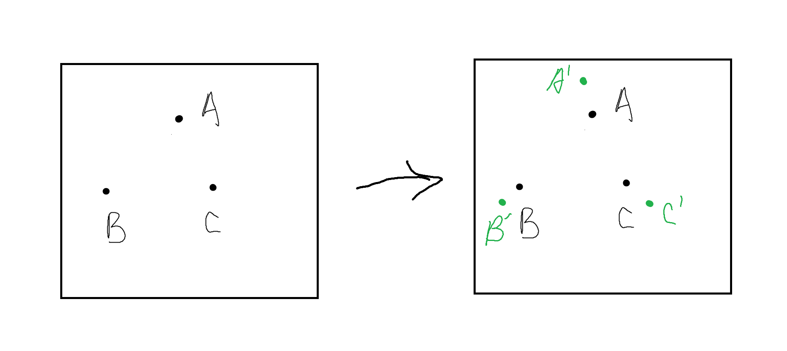

# 第一章 光是沿直线传播吗？
## 结论
    我先说结论，我的结论是光不是沿直线传播，或是空间的直线不是笔直的。

## 我的思想实验
    我们都知道宇宙在膨胀，因此当然我在读高中的时候，我就想到了一个问题，光真的是沿直线传播的吗？虽然我们在书本上的学到的是光沿直线传播。
    
    如图1-1所示。
    
    

    假设我们的宇宙中存在，点A，B，C三个点，就会存在直线A到B的是ab，B到C的直线是bc，那么从A到C的直线是ac。由于宇宙是在膨胀的，那么就会存在新的三个点，A'，B'，C'，并且A'到B'的直线是a'b'，B'到C'的直线是b'c'，那么从A'到C'的直线是a'c'。