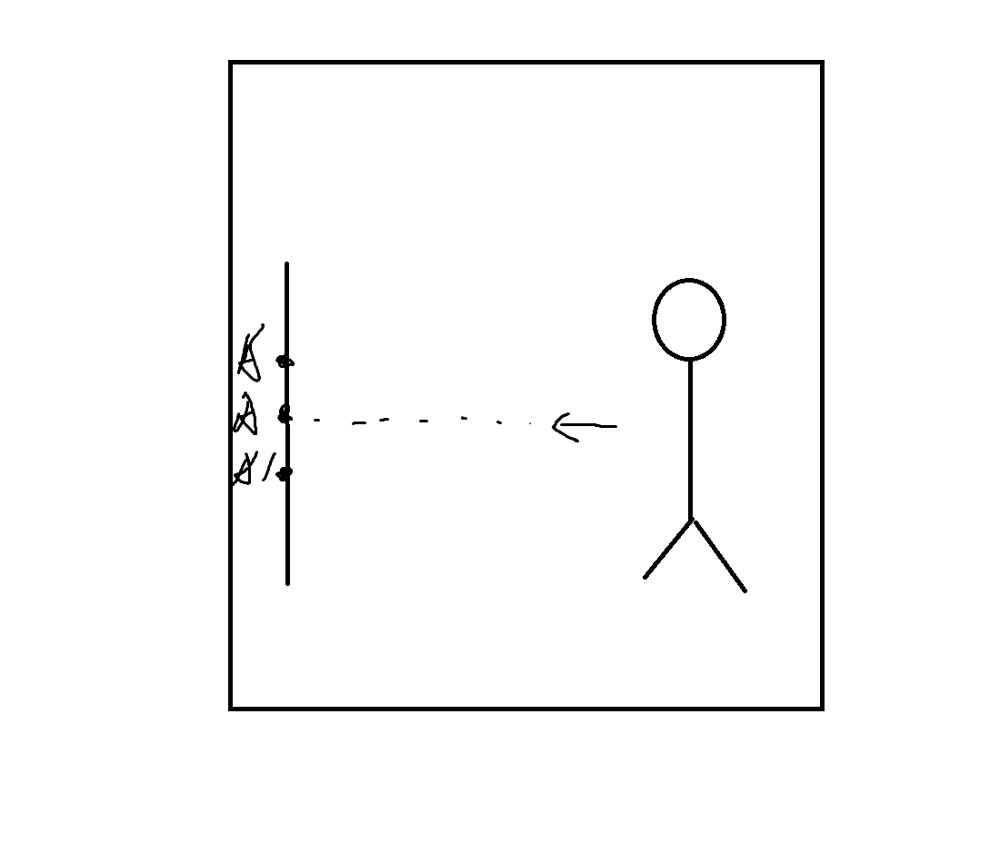
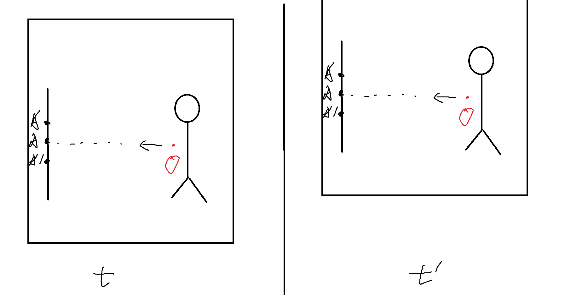

# 第一章 光是沿直线传播吗？
## 结论
    我先说结论，我的结论是光不是沿直线传播，或是空间的直线不是笔直的。
## 我的思想实验
    我们都知道宇宙在膨胀，因此当然我在读高中的时候，我就想到了一个问题，光真的是沿直线传播的吗？虽然我们在书本上的学到的是光沿直线传播。
    
 图片1-1

    如图1-1所示。假设我们的宇宙中存在，点A，B，C三个点，就会存在直线A到B的是ab，B到C的直线是bc，那么从A到C的直线是ac。由于宇宙是在膨胀的，那么就在t时间后，存在新的三个点，A'，B'，C'，并且A'到B'的直线是a'b'，B'到C'的直线是b'c'，那么从A'到C'的直线是a'c'。
    如果我们可以从"上帝”视角观察我的实验，那么假设从A向B射一个激光，那么到达B的时间是t，那么B点由于宇宙膨胀到了B'点。那么我请问，我们从A向B发射的光，是走AB直线还是走A'B'直线,或者是AB'直线？

    你暂时无法想出答案的，那么我们引用我的偶像——爱因斯坦的相对论里，不知道你们是否还记得相对论里面的电梯实验？如图1-2所示。

 图片1-2

    如图，当一个人在电梯上时，他向对面发射激光，请问激光会在图A点，还是A'点，还是A"点？当时爱因斯坦已经证明了是到A点和电梯是否加速运行，加速度a的大小方向无关。光永远是会射到镜子的点A的。
    
    因此我们我们在回忆图1-1的实验，你们现在是否有了答案？如果我们从观察者角度观测实验，那么我们觉得光的路线应该是A'B'，但是我们如果从"上帝”视角，那么光的路线是AB',因为光是从A点发射的，只是由于宇宙膨胀A移动到A'点，由于我们是观察这是无法感知A点和A'区别的，但是光的实际路径应该是AB'，但是不是直线AB'。因为我们宇宙是在加速膨胀，所以光的运动轨迹是曲线AB',第一是因为宇宙在加速膨胀且膨胀速度在变快，不是匀速膨胀，第二是因为A点不是宇宙的中心点，所以可以想象一下，所以AB'的路线是取线。
    
    此时一些聪明的朋友会想到，有没有可能是当时我们在A点是我发射的光是是向B'点射的,不是向B点射去的？好吧你们很聪明，但是我还是考虑到了，因为根据图1-2的电梯实验，我射向A的角度是一只水平向A射去的，因此我们在1-1的时候我们光的方向就是AB方向，而不是AB'方向。
    
    同样的其实电梯实验也证明了我所论证的结论，为了方便我们假设电梯是加速度向上运行，我们在根据图1-3

 图片1-3

    我们在发射时为t，当光到到A点为t'，那么我们从上帝视角观察光的路线就应该是曲线，但电梯里的人观察的光是直线，因为他无法感知到O与O'的差异，因此光是直线。

    所以我的结论是光不是沿直线传播，或是空间的直线不是笔直的。

___

# English
# Does light propagate in a straight line?
## Conclusion
    My conclusion is that light does not propagate in a straight line, or that the lines in space are not straight.
## My thought experiment
    We all know that the universe is expanding, so of course, when I was in high school, I thought of a question: does light really propagate in a straight line? Although what we learn from books is that light travels in a straight line.

 Figure 1-1

    As shown in Figure 1-1. Assuming that there are three points A, B, and C in our universe, the line A to B is ab, the line B to C is bc, and the line A to C is ac. Since the universe is expanding, there will be three new points after time t, A'，B'，C'， And the straight line from A 'to B' is a'b ', and the straight line from B' to C 'is b'c', so the straight line from A 'to C' is a'c '.
    If we can observe my experiment from the perspective of "God", then suppose a laser is emitted from A to B, and the time it takes to reach B is t. Then, point B has reached point B 'due to the expansion of the universe. May I ask, does the light emitted from A to B follow the AB line, the A'B' line, or the AB 'line?
    If you are unable to come up with an answer at the moment, let's quote from my idol Einstein's theory of relativity. Do you still remember the elevator experiment in relativity? As shown in Figure 1-2.

 Figure 1-2

    As shown in the figure, when a person is in an elevator and emits laser towards the opposite side, may I ask if the laser will be at point A, point A ', or point A "in the figure? At that time, Einstein had already proven that the direction of acceleration a is independent of whether the elevator is accelerating or not. Light will always reach point A on the mirror.
    
    So we are recalling the experiment in Figure 1-1, do you now have an answer? If we observe the experiment from the observer's perspective, we think that the path of light should be A'B '. However, if we observe from the "God's" perspective, the path of light is AB' because light is emitted from point A and only moves to point A 'due to the expansion of the universe. Since we are observing, we cannot perceive the difference between point A and A', but the actual path of light should be AB ', not a straight line AB'. Because our universe is expanding at an accelerated rate, the trajectory of light is curved AB '. Firstly, because the universe is expanding at an accelerated rate and the expansion speed is increasing, not at a constant speed. Secondly, because point A is not the center point of the universe, we can imagine the path of AB'. It's taking the line.
    
    At this point, some smart friends may wonder if it is possible that the light we emitted at point A was directed towards point B ', not towards point B? Okay, you guys are very smart, but I still considered it because according to the elevator experiment in Figure 1-2, the angle at which I shoot towards A is a horizontal direction towards A. Therefore, when we are in 1-1, the direction of our light is AB direction, not AB 'direction.
    
    Similarly, the elevator experiment has also proven the conclusion I have argued. For the convenience of assuming that the elevator is accelerating upwards, we are referring to Figure 1-3.

 Figure 1-3

    When we emit, it is t, and when the light reaches point A, it is t '. From the perspective of God, the path of the light should be a curve. However, the person in the elevator observes the light as a straight line because they cannot perceive the difference between O and O', so the light is a straight line.

    So my conclusion is that light does not propagate in a straight line, or that the lines in space are not straight.